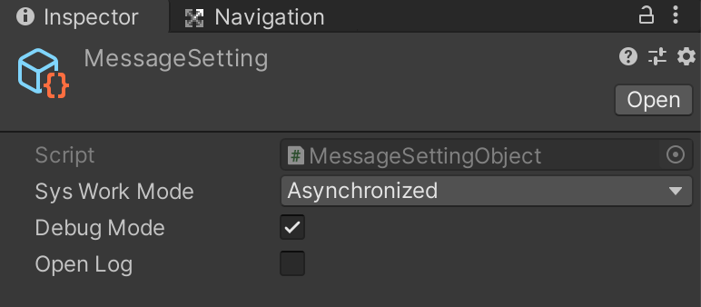

# 公共框架说明

[toc]

## 1.读表工具
###  1.1使用说明
* 一.拷贝 *Assets/Framework/ReadExcelForUnity*  路径下的全部文件到 Unity 工程中。
* 二.按如下格式编辑Excel表格,表格第一行为字段名称，第二行为字段数据类型。

**示例**： 

|Name|Age|Money|
|---|---|---|
|string|int|double|
|张三|20|59.56|
|李四|66|995.566|
|王五|32|9874554.221|

* 三.顶部工具栏 *REFU/Open Window* 打开窗口。
```
1. 选择表格文件。
2. 生成数据类型代码。
3. 设置输出路径。
4. 点击读取配置。
```

---
### 1.2注意事项
  界面|说明
  ---|:---
  当前选择文件|已经选择的表格文件。
  当前输出路径|读取表格时，对应文件的输出路径。
  使用命名空间|使用表格源文件名称作为命名空间，避免因不同表格文件的Sheet名重复而出现生成类型重复的情况。
  生成数据类型|每张Sheet会对应一个数据类型，应尽量避免重复的Sheet名称。<br>同一张表的Sheet名称绝对不能重复。
  读取表格数据|读取表中数据，并输出到对应的路径中。<br>在读取表格数据前，应确保已经生成了对应的数据类型。

 **Editor下对外接口:**  
```c#
/// <summary>
/// 对外接口，读取表格数据
/// </summary>
/// <param name="excelPath">表格路径</param>
/// <param name="exportPath">输出路径</param>
public static void ReadExcel(string excelPath, string exportPath)
```
 **示例:** 
 ```c#
using UnityEitor;
using UnityEditor.Build;
using UnityEditor.Build.Reporting;
using REFU;
public class Example : IPreprocessBuildWithReport{
	public int callbackOrder => -1;
	public void OnPreprocessBuild(BuildReport report)	{
	REFU.ReadExcel(Application.dataPath+"/A.xlsx",Application.dataPath+"/Resources/");
  }
}
 ```


---

## 2.存档工具
* 拷贝 *Assets/Framework/Save* 路径下的全部文件到 Unity 工程中。存档工具依赖并内置 ***LitJson*** 
* 点击工具栏 *Tools/Save/Open Save Path* 可以打开存档路径。
* 点击工具栏 *Tools/Save/Clear SaveData*	清空存档文件。
---
###  2.1配置说明
* 配置文件路径为 *../Save/Resources/SaveDataConfig.asset* ,如下图所示:


|配置属性|解释|
|---|---|
|是否加密|仅在编辑器下起效，是否对存档进行加密。发布时默认加密|
|AES加密密钥|当前使用的AES加密密钥，点击随机生成按钮可以更换密钥。<br> ***但使用原有密钥进行加密的存档将无法进行解析。*** |
|历史AES密钥|存储使用过的AES密钥，用于回滚密钥。|
|使用Unity版本号|使用的Unity的版本号作为存档版本号。|
|存档版本号|当前存档的版本号。当存档版本号发生变化时，会触发监听的事件，用于处理存档结构变化引起的潜在问题。|

---

### 2.2存档文件结构创建
* 存档文件类型需继承 ***SaveJsonData*** ,示例如下:
```c#
using System.Collections.Generic;

public class TestData : SaveJsonData
{
    public override string GetFileName => "TestData";	//生成存档文件的名称

		//测试基础类型
    public int test_field1 = 1;
    public string test_field2 = "测试";
		
		//测试自定义类型
    public class test_curtom_data
    {
        public float tc_field = 0.5f;
        public test_curtom_data() {}
        public test_curtom_data(float tc_field)
        {
            this.tc_field = tc_field;
        }
    }
    
		//测试数据结构
    public List<test_curtom_data> test_field3;

		//重载此方法为数据设置初始值
    public override T GetDefault<T>()
    {
        TestData data = new TestData();
        data.test_field3 = new List<test_curtom_data>();
        data.test_field3.Add(new test_curtom_data(1.5f));
        data.test_field3.Add(new test_curtom_data(77.57f));
        return data as T;
    }
}
```
---

### 2.3使用示例
* 使用如下方法进行初始化
```c#
public class SaveDataMgr : MonoSingleton<SaveDataMgr>{
    public static void Initialize(Action<string, string> onSaveVersionChange)
    }
```
* 使用如下方法加载存档
```c#
public class SaveDataMgr : MonoSingleton<SaveDataMgr>{
    public T LoadData<T>()
        where T : SaveJsonData, new()
        }
```

* 使用如下方法保存存档
```c#
public class SaveDataMgr : MonoSingleton<SaveDataMgr>{
    public T SaveData<T>()
        where T : SaveJsonData, new()
        }
```

* 使用如下方法备份存档
```c#
public class SaveDataMgr : MonoSingleton<SaveDataMgr>{
   public bool BackUp()
   }
```
* 使用如下方法替换备用存档
```c#
public class SaveDataMgr : MonoSingleton<SaveDataMgr>{
   public bool LoadBackUp()
   }
```

* 请参考 *../Save/Example* 下的例子使用。

---

## 3.消息系统
* 拷贝 *Assets/Framework/EasyMessage* 路径下的全部文件到 Unity 工程中。

### 3.1配置说明
* 配置文件路径为 *../Save/Resources/SaveDataConfig.asset* ,如下图所示:


|配置属性|解释|
|---|---|
|Sys Work Mode|消息系统工作模式。可以配置为同步或**异步(推荐)**工作模式|
|Debug Mode|是否开启调试模式|
|Open Log|是否开启Log|
### 3.2使用说明

* 引用 ***MessageSystem*** 命名空间,并实现消息处理接口。
* 单一消息UID处理接口
```c#
    /// <summary>
    /// 消息处理接口
    /// </summary>
    public interface IMessageHandler : IBaseMessageHandler
    {
        string getMessageUid { get; }
        void initHandleMethodMap(Dictionary<string, MessageHandleMethod> HandleMethodMap);
    }
```
* 多重消息UID处理接口
```c#
    /// <summary>
    /// 多重消息处理接口
    /// </summary>
    public interface IMultiMessageHandler : IBaseMessageHandler
    {
        void initMessageUids(List<string> MessageUids);
        void initHandleMethodMap(Dictionary<string, Dictionary<string, MessageHandleMethod>> HandleMethodMap);
    }
```
* 使用如下方法 ***注册/注销*** 消息监听
```c#
		//注册消息监听
    public class MessageCore : MonoBehaviour
    {
    		public static void RegisterHandler(IMessageHandler handler, 						MessageFilterMethod messageFilter = null)

    		public static void RegisterHandler(IMultiMessageHandler handler, 					MessageFilterMethod messageFilter = null)
    }
```
```c#
		//注销消息监听
    public class MessageCore : MonoBehaviour
    {
    		public static void UnregisterHandler(IMessageHandler handler)
    	
    		public static void UnregisterHandler(IMultiMessageHandler handler)
    }
```
* **注意:** 如果忘记在对象被销毁时注销消息监听，系统会在下次发送该消息时，主动移除已被销毁的监听者。但还是***推荐*** 根据对象的生命周期***主动注销消息的监听***。
---

* 使用如下方法发送消息
```c#
    public class MessageCore : MonoBehaviour
    {
    		public static void SendMessage(string msg_uid, string method_id,params object[] msg_params)
    }
```

* 可以通过实现消息过滤方法进行消息的过滤,并在消息注册时进行传递。此方式主要运用于过滤**同类型**的**不同实例**间的消息。
```c#
    /// <summary>
    /// 消息过滤委托,用于判断该对象是否满足过滤条件
    /// </summary>
    /// <param name="msg_uid">待处理的消息UID</param>
    /// <param name="mark">过滤参数</param>
    /// <returns>返回为真时，根据过滤模式判断是否触发</returns>
    public delegate bool MessageFilterMethod(string msg_uid, object mark);
```

* 使用如下方法可以使用过滤并发送消息
```c#
    public class MessageCore : MonoBehaviour
    {
        /// <summary>
        /// 发送消息，满足过滤条件的消息监听者将被触发。
        /// </summary>
        /// <param name="msg_uid">消息UID</param>
        /// <param name="method_id">子ID</param>
        /// <param name="filter_mark">过滤参数</param>
        /// <param name="msg_params">消息参数</param>
    		public static void SendMessageInclude(string msg_uid, string method_id, object[] filter_mark, params object[] msg_params)
    
    		/// <summary>
        /// 发送消息，满足过滤条件的消息监听者会被过滤。
        /// </summary>
        /// <param name="msg_uid">消息UID</param>
        /// <param name="method_id">子ID</param>
        /// <param name="filter_mark">过滤参数</param>
        /// <param name="msg_params">消息参数</param>
    		public static void SendMessageExcept(string msg_uid, string method_id, object[] filter_mark, params object[] msg_params)
    }
```

* 请参考 *../EasyMessage/Example* 下的例子使用。

### 3.3调试

* 配置中开启调试后，继承消息处理接口的 ***Monobehavior*** 对象可以在Inspector面板中查看调试面板。

* 可以查看该对象注册监听的消息信息。
* 可以查看该对象的消息相应记录，并且可以查看调用者的堆栈信息以及调用时参数的记录。
## 4.其他
一些其他的轻量化工具设计，按需实用。
* 泛形单例***Singleton<T>*** 与***MonoSingleton<T>*** 。
* ***FSM*** 有限状态机，详见上次[分享](https://yomobtech.feishu.cn/file/boxcnddbgXH7prqrZlM1Ma3qhYd "分享链接")。
* ***Sequence*** 事件序列，详见上次[分享](https://yomobtech.feishu.cn/file/boxcnddbgXH7prqrZlM1Ma3qhYd "分享链接")。
* 轻量化***UI***框架。

## 5.公共框架工程地址
[工程项目地址](https://github.com/brkdyh/CommonFramework.git)

